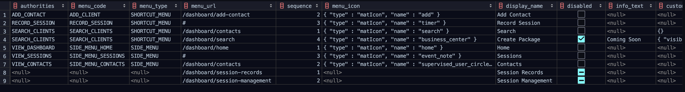
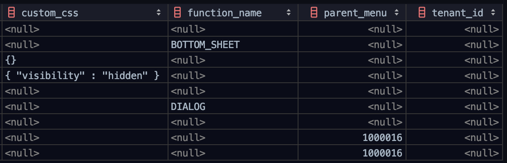
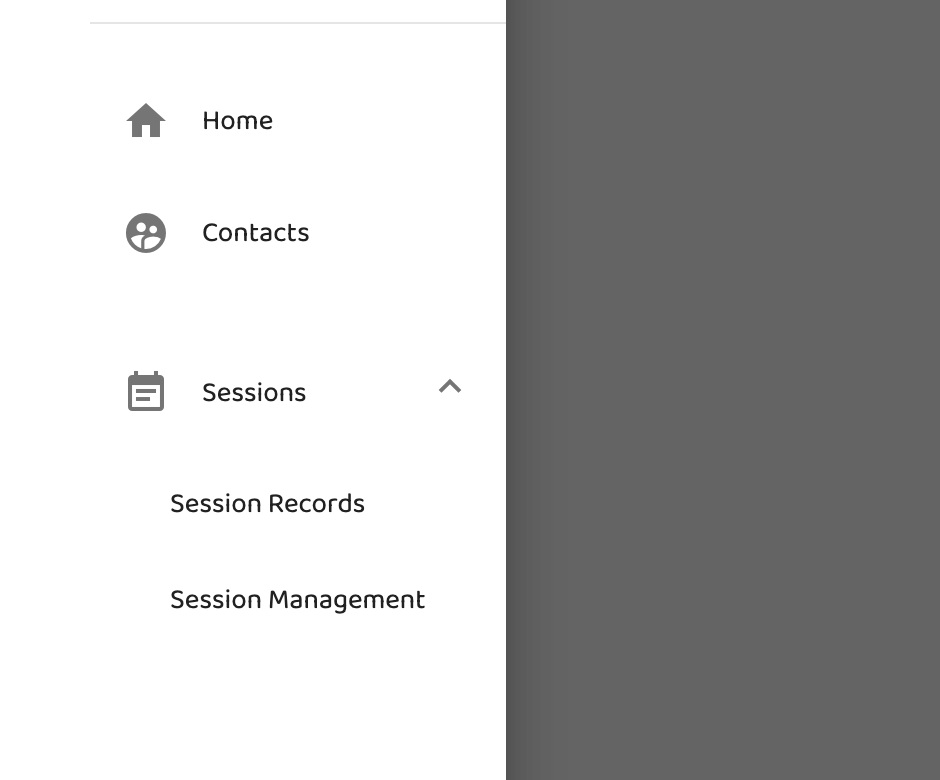
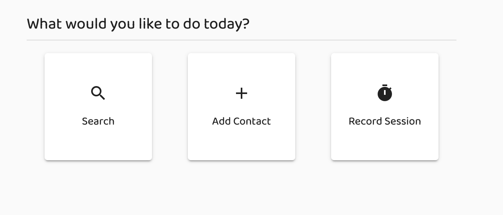
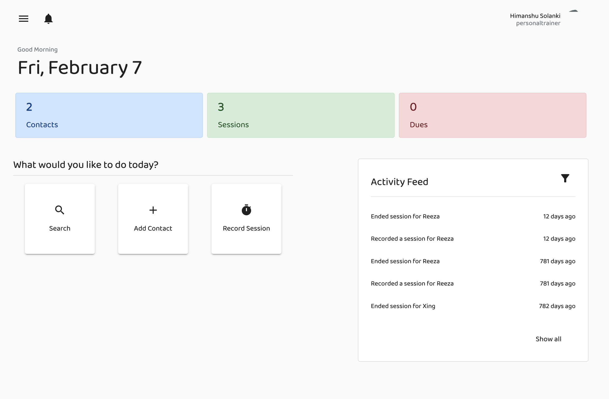
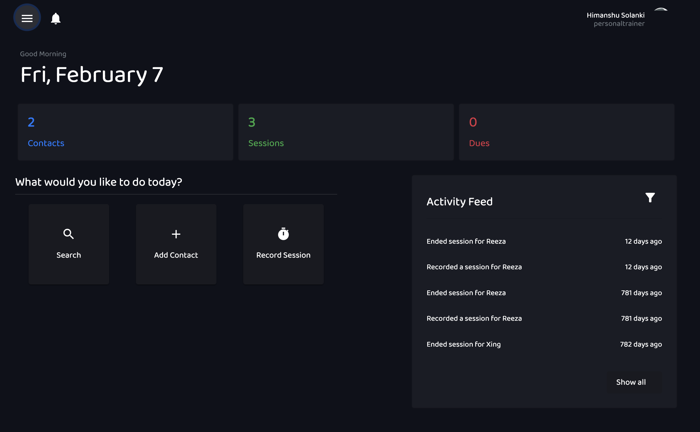
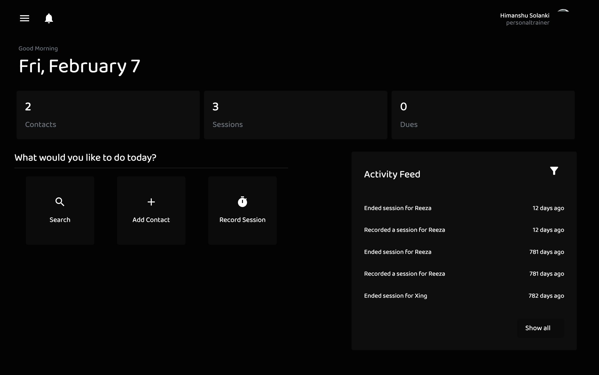
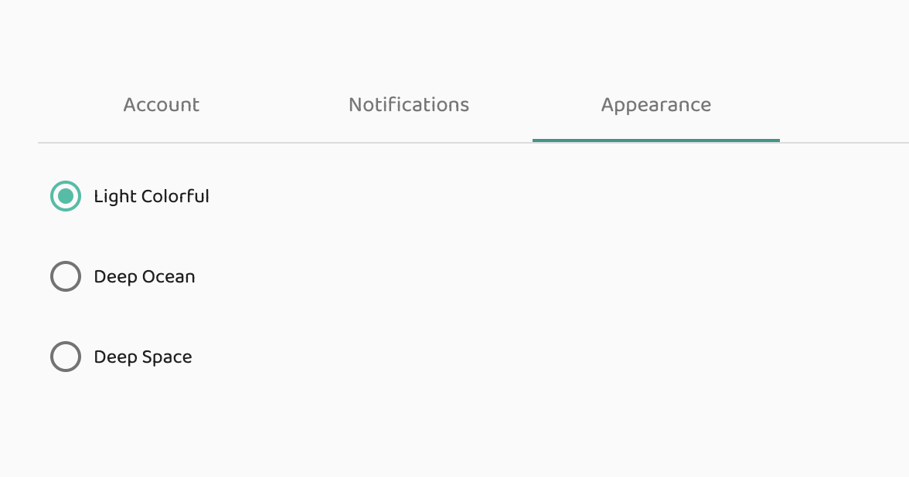

# dynamic-menu-angular
Dynamically creates the menu by fetching the configuration from backend

app_menu table




## Menu Options
### Side Menu
It is a dynamic accordion which slides out from the left on click of menu button.



### Shortcut Menu
It is a dynamic home screen customizable shortcuts.



## Dashboard Sample

### Default Theme



### Deep Ocean Theme



### Deep Space Theme



### Theme Switcher




# Code Samples
## Side Menu

```ts
\\model.ts
export interface MenuItem {
menuCode:string;
menuIcon:any;
displayName:string;
menuType:string;
menuUrl:string;
sequence:number;
disabled:Boolean;
infoText:string;
customCss:any;
functionName;string;
childMenus;
}
```

```html
<! Dynamic Accordian Population>
<mat-accordion #navMenu="matAccordion" [displayMode]="displayMode" [multi]="multi" class="app-nav-accordion">
      <span *ngFor="let menuItem of sideMenuItems">
      <mat-nav-list>
        <button *ngIf="menuItem.childMenus.length == 0" routerLink="{{menuItem.menuUrl}}" (click)="resolve(menuItem.functionName)" mat-menu-item>
          <mat-icon *ngIf="menuItem.menuIcon.type == 'matIcon'">{{menuItem.menuIcon.name}}</mat-icon>
          <span>{{menuItem.displayName}}</span>
        </button>
      </mat-nav-list>
      <mat-expansion-panel *ngIf="menuItem.childMenus.length > 0" class="mat-elevation-z0">
        <mat-expansion-panel-header class="py-0 pl-0 pr-4">
          <span mat-menu-item>
            <mat-icon *ngIf="menuItem.menuIcon.type == 'matIcon'">{{menuItem.menuIcon.name}}</mat-icon>
            <span>{{menuItem.displayName}}</span>
          </span>
        </mat-expansion-panel-header>
        <mat-nav-list class="p-0">
            <span  style="font-family: 'Baloo Thambi 2', cursive" *ngFor="let childMenu of menuItem.childMenus" mat-menu-item routerLink="{{childMenu.menuUrl}}" (click)="resolve(childMenu.functionName)">{{childMenu.displayName}}</span>
        </mat-nav-list>
    </mat-expansion-panel>
    </span>
    </mat-accordion>
    ```

